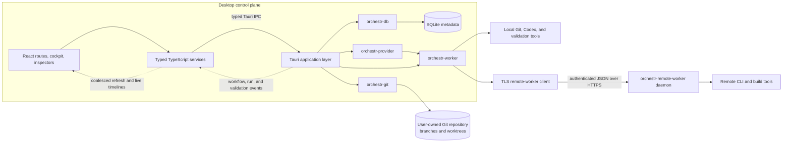
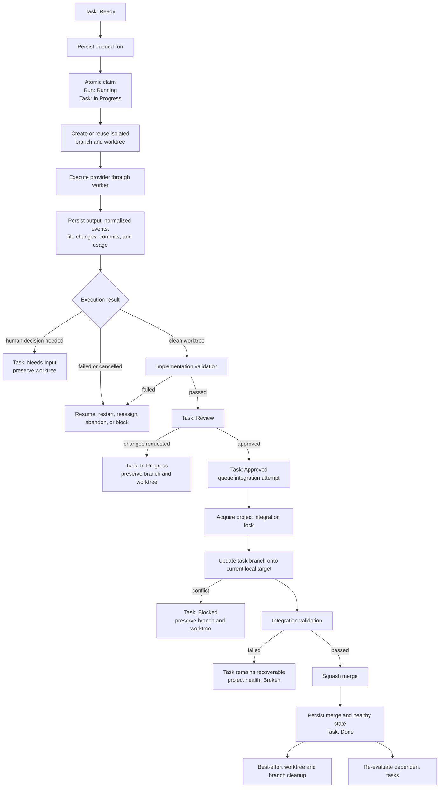

# Orchestr

Orchestr is a local-first desktop control plane for Git-backed software projects
worked on by humans and AI agents. It combines a delivery-focused Kanban,
isolated Git worktrees, durable execution timelines, human review, and a
serialized integration queue.

The central invariant is deliberately stricter than “the agent finished”:

> A task is Done only after its accepted changes are present on the configured
> target branch and that branch is healthy.

Orchestr is a pre-1.0 application. The local workflow is implemented and the
repository includes automated Windows packaging; the limitations section below
separates working behavior from deferred product work.

## The problem

Code generation is only one step in software delivery. Parallel AI runs can
produce branches quickly, but a team still has to answer harder questions:

- Was the task actually ready, or was a dependency still unfinished?
- Did the process complete with committed, reviewable work?
- Does the branch still pass validation after being updated onto the current
  local integration target?
- Can a failed run be diagnosed or resumed without losing its worktree?
- Is a task waiting on an agent, a worker, a reviewer, a shared blocker, or a
  human decision?

Orchestr models those concerns as persisted workflow state. Run completion,
review approval, integration, branch health, and task completion remain separate
events, so agent activity is not mistaken for delivered project progress.

Today the application supports Git-backed projects, dependencies and readiness,
milestones and epics, local Codex execution in task worktrees, implementation
and integration validation, human or agent-assisted review, recovery and revert
records, WIP-aware scheduling, project blockers, Needs Input, ADR-style project
knowledge, and optional remote process workers.

## Screenshots

These existing repository assets use representative local data.

### Delivery workflow


### Task execution and human supervision


### Integrated project progress


### Worker inventory


## Architecture

The React renderer is intentionally not a privileged execution environment.
Components call typed TypeScript services; the Tauri host coordinates domain
transitions and delegates persistence, Git, provider, and process behavior to
Rust crates.



Key ownership boundaries:

| Area | Owner | Responsibility |
| --- | --- | --- |
| Presentation | `apps/desktop/src` | Routes, the workflow cockpit, inspectors, optimistic planning-state reordering, and typed IPC wrappers. |
| Application orchestration | `apps/desktop/src-tauri` | Authorized transitions, scheduler dispatch, review and integration workflows, event emission, and active process handles. |
| Persistence and domain state | `crates/orchestr-db` | SQLite migrations, transactions, readiness, queues, locks, durable histories, and project-scoped read models. |
| Git | `crates/orchestr-git` | Repository inspection, branch/worktree lifecycle, update/rebase, squash integration, cleanup, and revert through command/argument arrays. |
| Execution | `crates/orchestr-worker` | Local processes, stdout/stderr streaming, cancellation, capability detection, and the remote-worker client. |
| AI provider | `crates/orchestr-provider` | Provider status and structured execution requests. Codex is the implemented adapter. |
| Remote execution | `crates/orchestr-remote-worker` | HTTPS jobs authenticated with a bearer token, with working directories constrained to configured workspace roots. |

SQLite stores orchestration metadata, not project source. Source remains in
normal repositories owned by the user, and provider credentials remain in the
worker environment.

## Delivery data flow

Implementation can run in parallel, but integration is serialized per project.
The two validation stages answer different questions: whether a task works on
its branch, and whether it still works when updated onto the current local
target branch.



## Important engineering decisions and trade-offs

| Decision | Benefit | Cost / trade-off |
| --- | --- | --- |
| Keep task state separate from run state | A completed process cannot bypass review or integration. | More explicit transitions and recovery paths must be maintained. |
| Store metadata in bundled SQLite and source in Git | The desktop works offline and does not take ownership of source history. | The current control plane is single-process and local rather than a multi-controller service. |
| Use the installed Git CLI behind one service | Worktrees, rebases, and user-visible Git behavior retain native semantics. Commands use argument arrays rather than shell interpolation. | Git is a prerequisite, and platform/path edge cases still need explicit handling. |
| Give implementation tasks isolated worktrees | Parallel work does not mutate the primary checkout, and failed work remains inspectable. | Worktrees consume disk and require careful, retryable cleanup. An existing commit is required as a base. |
| Serialize integration per project | Concurrent agents cannot mutate one target branch at the same time. | Integration throughput is intentionally bounded even when implementation capacity is idle. |
| Validate twice | Branch-local failures and current-target integration failures are distinguished. | Validation costs time and must be configured per project; an empty validation stage is recorded as skipped. |
| Squash task branches | The target branch gets one task-level commit despite iterative agent commits. | Orchestr stores run events, the final observed branch commit, and the merge commit, not a durable copy of the deleted branch's full granular history. |
| Persist integration before cleanup | Once the merge is recorded, a cleanup error cannot turn it into a false integration failure. | Stale artifacts can require a retry, and Git plus SQLite cannot form one atomic transaction. |
| Gate scheduling before applying priority | Dependencies, health, blockers, capabilities, provider readiness, WIP, and capacity determine eligibility; priority only orders eligible work. | Scheduler policy is more involved than a simple FIFO queue. |
| Build the cockpit as a backend read model | The compact UI projects canonical domain state instead of inventing a second frontend state machine. | TypeScript and Rust wire types are currently mirrored manually, with compatibility normalization in the frontend. |
| Keep provider credentials on workers | SQLite never becomes a credential vault for Codex authentication. | Every execution worker must be configured and authenticated independently. |

## Technology choices

| Technology | Why it is used here |
| --- | --- |
| React 19 + TypeScript | Component composition and typed UI/service boundaries for a dense desktop control room. |
| Vite | Fast renderer development and a small frontend build pipeline. |
| Tauri 2 | A web-based renderer with a Rust host for filesystem, process, Git, and SQLite access. |
| Rust workspace | Separate persistence, Git, worker, provider, and remote-daemon boundaries with shared typed models. |
| SQLite via `rusqlite` | Embedded, migratable, local-first metadata storage; SQLite itself is bundled. |
| `dnd-kit` | Drag-and-drop task ordering for the limited planning transitions that gestures are allowed to perform. |
| Lucide + plain CSS | A restrained icon set and project-specific control-room visual system without a large component framework. |
| Vitest + Testing Library | Frontend service, model, and component behavior tests. |
| Rust unit/integration-style tests | State-machine, persistence, Git temporary-repository, worker, provider, and protocol coverage. |

## Local setup

Prerequisites:

- Node.js 22.12 or later
- stable Rust and Cargo
- Git
- the platform prerequisites for [Tauri 2](https://v2.tauri.app/start/prerequisites/)
- optional: the Codex CLI, installed and authenticated in the worker
  environment, when AI execution is needed

Install dependencies and start the full desktop application:

```bash
npm ci
npm run tauri -- dev
```

`npm run dev` starts only the Vite renderer. Most product behavior needs the
Tauri command boundary, so the full command above is the useful development
path.

The application creates `orchestr.db` in Tauri's platform-specific
application-data directory and applies all embedded migrations at startup.

## Deployment and packaging

Orchestr is packaged as a native desktop application; there is no hosted web
deployment in this repository.

```bash
# Renderer assets only
npm run build

# Native bundle(s) for the current host platform
npm run tauri -- build
```

`.github/workflows/build-and-release.yml` currently runs on Windows x64. Pull
requests, `main` pushes, and manual runs build an NSIS test installer artifact.
A newly created numeric tag publishes a GitHub Release, for example:

```bash
git tag 0.9.1
git push origin 0.9.1
```

The workflow uses the tag as the Tauri bundle version and produces a Windows
installer. Linux and macOS release jobs, code signing, and an auto-updater are
not configured.

The optional remote worker is a separate Rust daemon:

```bash
cargo build --release -p orchestr-remote-worker
```

Its TLS certificate, private key, bearer token, bind address, and allowed
workspace roots are provided through environment variables. See
[docs/remote-worker.md](docs/remote-worker.md) for the complete setup and trust
model.

## Testing and quality gates

| Command | Purpose |
| --- | --- |
| `npm run check` | TypeScript project check. |
| `npm test` | Vitest service, model, and component tests. |
| `npm run test:coverage` | Targeted V8 coverage report. |
| `cargo test --workspace` | Rust workspace tests, including temporary-repository Git scenarios. |
| `npm run build` | TypeScript plus production renderer build. |
| `npm run crap:ts` | Coverage-backed CRAP report for selected TypeScript boundaries. |
| `npm run crap:rust` | Rust coverage plus comparison with the checked-in CRAP baseline. |
| `npm run crap` | Both CRAP gates. |

The Rust CRAP commands require the same tools pinned in CI:

```bash
cargo install cargo-llvm-cov --version 0.9.0 --locked
cargo install cargo-crap --version 0.4.3 --locked
```

CI runs the TypeScript check, both coverage-backed CRAP gates, and a native
Windows package build. The TypeScript coverage set is targeted rather than
repository-wide. There is currently no browser or packaged-desktop end-to-end
suite, and CI does not yet enforce ESLint, Prettier, `cargo fmt`, or Clippy.

## Observability

Observability is local and workflow-oriented. It is designed to explain what
happened to a task and why work did or did not advance.

| Evidence | Persistence / presentation |
| --- | --- |
| Provider stdout/stderr and normalized run events | Stored per run and shown as a chronological task timeline. |
| File and commit observations | Recorded around execution so review is not dependent on ephemeral console output. |
| Validation attempts and command events | Stored separately for implementation and integration stages, including output and exit codes. |
| Integration attempts and project locks | Queue order, conflicts, failures, merge commits, and cleanup errors remain inspectable. |
| Project health | Tracks the latest validation, last known healthy state, last integration, and failing gate. |
| Scheduler decisions | Stores scheduled, skipped, or blocked outcomes with a human-readable reason. |
| Task status history | Captured durably and used for workflow and progress read models. |
| Needs Input, blockers, ADRs, reviews, recovery, and collaboration | Persisted as first-class records rather than hidden prompt context. |
| Tauri events | Trigger live/coalesced renderer refreshes while the database remains authoritative. |

There is no Sentry, OpenTelemetry pipeline, hosted log collector, or remote crash
reporting. Diagnostic evidence remains in the local SQLite database unless a
user explicitly exports a run log.

## Known limitations

- Codex is the only provider that currently executes, plans, and reviews.
  Other provider values are configuration placeholders, not working adapters.
- A project's `default_branch` is also its integration target, and squash merge
  is the only implemented strategy.
- Integration uses the current local target branch. Orchestr does not fetch or
  pull from a remote before updating a task branch, so upstream freshness is an
  operator responsibility.
- Git and SQLite cannot commit atomically. A crash after Git creates the squash
  commit but before Orchestr records it can require manual reconciliation; the
  current startup recovery does not infer the landed commit.
- The project integration lock serializes Orchestr operations, not external Git
  commands. The primary checkout should not be mutated by another process while
  validation and integration are running.
- Validation is project-configured. With no commands configured, a stage is
  recorded as skipped and passes; a healthy label is only as strong as the
  configured gates.
- Successful execution verifies a clean worktree but does not require a new
  commit or non-empty diff. A clean no-op run can therefore reach Review.
- Validation commands run on the desktop's local worker even when implementation
  ran remotely. A remote-only toolchain cannot currently satisfy those gates.
- Remote execution does not replicate repositories. Desktop and remote worker
  must share or mount the registered workspace, and one enabled remote mapping
  is allowed per project.
- Remote jobs and buffered events live in daemon memory. A desktop or network
  interruption can reconnect while the daemon remains alive; a daemon restart
  loses that job state.
- Startup reconnects persisted remote runs, but not an interrupted local child
  process. Local restart recovery remains incomplete.
- Request Changes preserves the completed run's branch/worktree and returns the
  task to In Progress, but the current commands do not provide a complete rerun
  path from that completed source run. This review-revision loop still requires
  manual intervention.
- Automated release packaging is Windows x64/NSIS only. Signing and automatic
  updates are not configured.
- The test suite emphasizes domain, service, component, and temporary-repository
  behavior. It does not yet drive a packaged desktop application end to end,
  and frontend coverage is targeted rather than comprehensive.
- The Rust application layer and database crate, plus the main board component,
  have grown into large files. Their conceptual boundaries are clearer than
  their current module boundaries and would benefit from further extraction.
- Rust and TypeScript IPC models are mirrored manually rather than generated
  from a shared schema.
- SQLite and in-memory process handles make the desktop a single-controller
  design. Multi-controller coordination and cloud sync are outside the current
  implementation.

## Further reading

- [CASE_STUDY.md](CASE_STUDY.md) — the most difficult engineering problems and
  the solutions used in this repository
- [docs/architecture.md](docs/architecture.md) — milestone-by-milestone design
  history and boundary details
- [docs/remote-worker.md](docs/remote-worker.md) — remote execution setup,
  authentication, and constraints
- [MILESTONES.md](MILESTONES.md) — implemented milestone history
