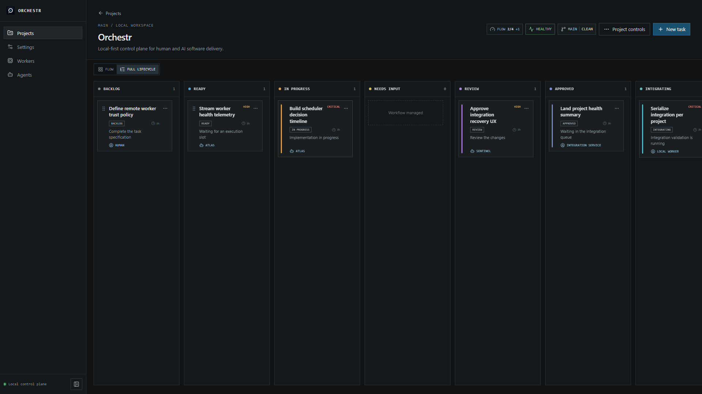
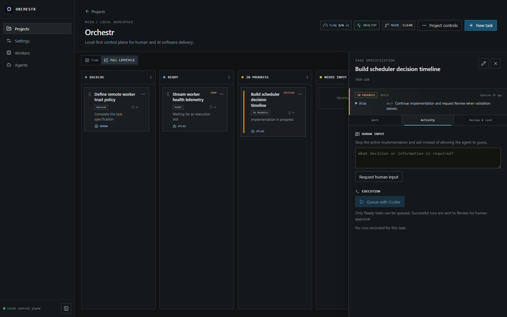
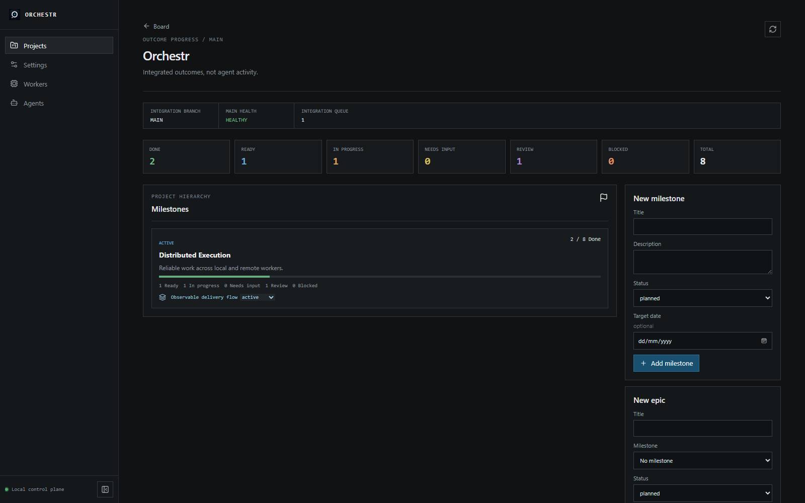
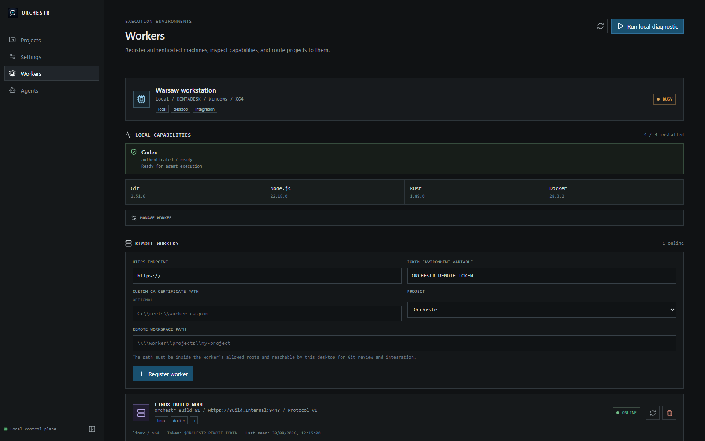

# Orchestr

Orchestr is a local-first engineering control room for Git-backed projects,
Kanban work, and human-supervised AI workers. Its default Workflow Cockpit
projects work into four readable stages: Queue, Build, Verify & Land, and Done.
An Attention tray gathers work that needs a human decision, while the Agent
Activity rail shows live and queued execution. Cards explain the current actor,
why work is waiting, and what happens next; a phase-aware inspector reveals the
relevant work, activity, or review details on demand. The Full Lifecycle view
remains available for diagnostics.

The cockpit is a focused projection, not a weaker state machine. Orchestr still
persists the canonical Backlog, Ready, In Progress, Needs Input, Review,
Approved, Integrating, Blocked, and Done statuses, and Done still requires
accepted changes on a healthy integration branch. The workflow includes bounded
parallel execution, durable run and integration recovery, and traceable Git
reverts for integrated regressions. Agents can pause with a persisted Needs
Input request, while scoped project blockers suppress unsafe automatic
scheduling until their shared cause is resolved. Accepted ADRs provide durable,
task-relevant project knowledge to implementers and reviewers.
Authenticated TLS remote workers can execute project-assigned tasks on another
machine while their output and lifecycle remain visible in the same timeline.
The worker inventory exposes editable names and labels, machine capabilities,
provider readiness, concurrency, connectivity, and scheduler-enforced
maintenance state for local and remote execution environments.
Tasks can declare required worker capabilities, and the Flow scheduler now
selects priority-ordered Ready work only when a matching provider-ready worker,
agent slot, worker slot, project WIP slot, and downstream capacity are all
available. Persisted decisions explain why each task was scheduled or held.
The board now includes a read-only planning agent workspace: Codex can turn a
project goal into a persisted milestone, epic, and dependency-aware task draft,
while explicit human approval atomically creates the proposed project work.
Agents now coordinate through a persisted project ledger rather than hidden
peer-to-peer messages. Typed requests, blockers, interface changes, comments,
escalations, replies, and task references remain visible to humans and are
injected into relevant later task runs.

## Screenshots

The views below use representative local demo data.

### Delivery workflow



### Task execution and human supervision



### Integrated project progress



### Worker inventory



## M0 development

Prerequisites:

- Node.js 22 or later
- Rust stable with Cargo and the platform prerequisites for [Tauri v2](https://v2.tauri.app/start/prerequisites/)

Install frontend dependencies and start the desktop app:

```bash
npm install
npm run tauri -- dev
```

Useful checks:

```bash
npm run check
npm run build
cargo test -p orchestr-db
cargo test -p orchestr-git
```

See [remote worker setup](docs/remote-worker.md) to configure the M21 worker
daemon, authentication, TLS trust, and shared workspace.

## CRAP quality gates

The Tauri workflow runs coverage-backed CRAP checks for both the desktop
TypeScript service boundary and the Rust workspace:

```bash
npm run crap:ts
npm run crap:rust
# or both
npm run crap
```

`crap4ts` currently covers the agent-review, collaboration, flow-control,
recovery, knowledge, planning, and worker service boundaries. The Rust gate compares against
the checked-in baseline, failing for a regression or for a new function whose
score reaches 30.
Refresh that baseline only after reviewing and intentionally accepting a report
change:

```bash
npm run crap:rust:baseline
```

The first launch creates Orchestr's local SQLite database in the operating
system application-data directory and applies its migrations automatically.

## Releases

The release workflow uses the numeric Git tag as the Tauri bundle version and
installer filename. For example:

```bash
git tag 0.2.1
git push origin 0.2.1
```

This publishes `Orchestr_0.2.1_x64-setup.exe`.

See [the M0 architecture notes](docs/architecture.md) for ownership boundaries
and planned crate extraction points.
